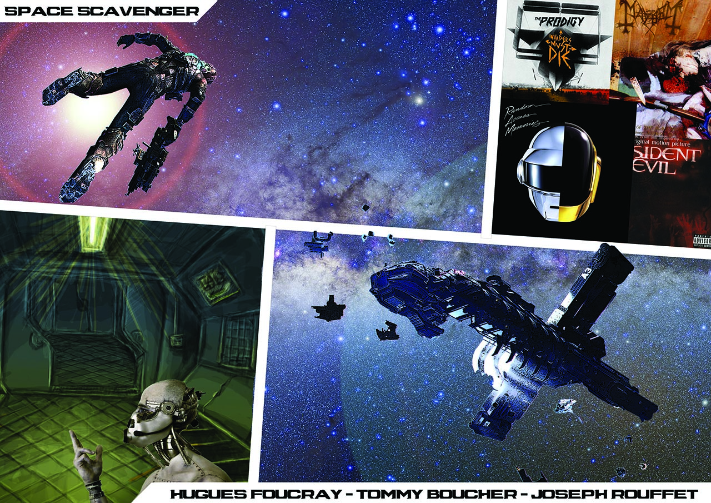

#Space Scavenger

##Le projet

###Histoire
Une guerre spatiale fait rage !  
Vous tentez de survivre en tant que pillard. Votre seule chance de survie est de récupérer des cellules d'énergie sur les épaves de champs de bataille.  
Votre tâche ne sera pas aisée, ces épaves sont envahis de robots d'une origine inconnue...
Bonne chance...
###Manuel
En cours d'écriture...
####Technologie
- [NodeJS](http://nodejs.org) Plateforme de développement pour applications web.
- [Socket.io](http://socket.io) WebSocket cross-browser pour applications en temps réel.
- [ThreeJS](http://threejs.org) Librairie WebGL.

####Utilisation
Lancement : node app.js puis visiter la page <a href="http://localhost:3000" target="_blank">localhost:3000</a>

##Crédits
- Hugues FOUCRAY, développeur et concepteur.
- Joseph ROUFFET, développeur et concepteur.
- Tommy BOUCHER, développeur et concepteur.
- École Privée des Sciences Informatiques - LYON

## License
